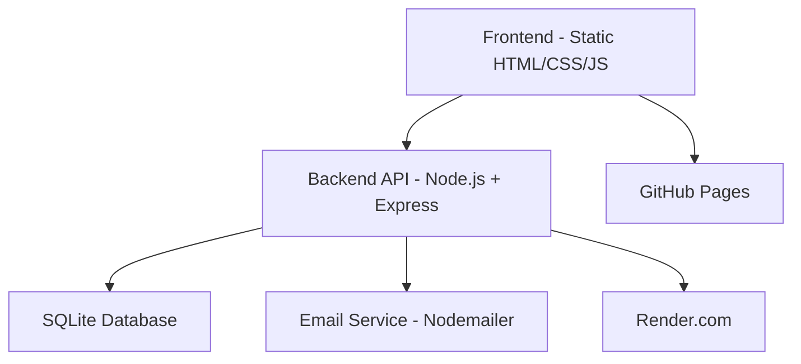

# 🌟 Rank-Anything

<div align="center">


**A modern, community-driven platform for rating and reviewing anything**

[](https://xunjianyin.github.io/rank-anything/)
[](https://rank-anything-backend.onrender.com/)

[](https://github.com/xunjianyin/rank-anything)
[](https://github.com/xunjianyin/rank-anything)

[English](README.md) | [中文](README_zh.md)

</div>

---

## 📖 Table of Contents

- [✨ Features](#-features)
- [🎯 What Makes It Special](#-what-makes-it-special)
- [🏗️ Architecture](#️-architecture)
- [🚀 Quick Start](#-quick-start)
- [🌐 Deployment](#-deployment)
- [📱 Usage Guide](#-usage-guide)
- [🔧 API Reference](#-api-reference)
- [🛡️ Security & Moderation](#️-security--moderation)
- [🤝 Contributing](#-contributing)
- [📄 License](#-license)

---

## ✨ Features

### 🎨 **Modern User Experience**
- 🌈 Beautiful gradient UI with responsive design
- 🔍 Advanced search with tag filtering
- ⭐ Interactive 5-star rating system
- 📱 Mobile-first responsive interface

### 👥 **Community-Driven**
- 🔐 Secure user authentication with email verification
- 👑 Admin panel for user management
- 🗳️ Democratic proposal system for content moderation
- 👤 User profiles with activity tracking

### 🏷️ **Smart Organization**
- 📂 Two-level structure: Topics → Objects
- 🏷️ Flexible tagging system with inheritance
- 🔄 Real-time content filtering
- 📊 Comprehensive statistics and analytics

### 🛡️ **Content Safety**
- 🚫 Advanced content filtering (blocks inappropriate content)
- ⚖️ Community moderation system
- 🚨 User reporting and restriction system
- 📝 Edit history tracking

### 📈 **Analytics & Insights**
- 📊 Detailed user statistics
- 📈 Daily activity charts
- 🎯 Rating distribution analysis
- 📅 Time-based activity tracking

---

## 🎯 What Makes It Special

### 🌟 **Multiple Editors Display**
When multiple people edit the same topic or object, see all contributors:
- Shows up to 3 editors: "by Alice, Bob, Charlie"
- Click "..." to see all editors in a popup
- All usernames are clickable to view profiles

### 🔄 **Smart Tag Inheritance**
- Objects automatically inherit tags from their parent topics
- Add specific tags to individual objects
- Powerful tag-based search and filtering

### 🗳️ **Democratic Moderation**
- Users can propose edits to content they don't own
- Community voting system for proposals
- Transparent before/after change display

### 📊 **Rich Statistics**
- Personal user dashboards with activity charts
- Object-specific analytics with rating distributions
- Topic-level statistics and insights

---

## 🏗️ Architecture



### 🎨 **Frontend Stack**
- **Framework**: Vanilla JavaScript (no dependencies)
- **Styling**: Modern CSS with gradients and animations
- **Charts**: Chart.js for analytics visualization
- **Deployment**: GitHub Pages, Vercel, or Netlify

### ⚙️ **Backend Stack**
- **Runtime**: Node.js with Express.js
- **Database**: SQLite with comprehensive schema
- **Authentication**: JWT tokens with bcrypt hashing
- **Email**: Nodemailer with multiple SMTP fallbacks
- **Deployment**: Render.com or any Node.js hosting

---

## 🚀 Quick Start

### 📋 Prerequisites
- Node.js 16+ installed
- Git for version control
- A text editor (VS Code recommended)

### 🔧 Local Development

1. **Clone the repository**
   ```bash
   git clone https://github.com/xunjianyin/rank-anything.git
   cd rank-anything
   ```

2. **Start the backend**
   ```bash
   cd backend
   npm install
   node index.js
   ```
   Backend will run on `http://localhost:3001`

3. **Start the frontend**
   ```bash
   cd docs
   # Open index.html in your browser or use a local server
   python -m http.server 8000  # Python 3
   # OR
   npx serve .  # Node.js
   ```
   Frontend will run on `http://localhost:8000`

4. **Update configuration**
   In `docs/script.js`, set:
   ```javascript
   const BACKEND_URL = 'http://localhost:3001';
   ```

---

## 🌐 Deployment

### 🚀 **Backend Deployment (Render)**

1. **Create a Render account** at [render.com](https://render.com)

2. **Create a new Web Service**
   - Connect your GitHub repository
   - Set **Root Directory**: `backend`
   - Set **Build Command**: (leave blank)
   - Set **Start Command**: `node index.js`

3. **Environment Variables** (optional)
   ```
   JWT_SECRET=your_super_secret_jwt_key_here
   EMAIL_PASSWORD=your_email_app_password
   ```

4. **Deploy** and note your backend URL

### 🌍 **Frontend Deployment (GitHub Pages)**

1. **Update backend URL** in `docs/script.js`:
   ```javascript
   const BACKEND_URL = 'https://your-app-name.onrender.com';
   ```

2. **Enable GitHub Pages**
   - Go to repository Settings → Pages
   - Set source to `Deploy from a branch`
   - Select `main` branch and `/docs` folder
   - Save and wait for deployment

3. **Access your app** at `https://yourusername.github.io/rank-anything/`

---

## 📱 Usage Guide

### 🔐 **Getting Started**
1. **Register** with email verification
2. **Login** to access all features
3. **Explore** existing topics or create your own

### 📂 **Managing Content**
- **Topics**: Create categories (e.g., "Best Restaurants in NYC")
- **Objects**: Add items to topics (e.g., "Joe's Pizza")
- **Tags**: Organize with flexible tagging system
- **Ratings**: Rate 1-5 stars with optional reviews

### 🎯 **Daily Limits**
- 📝 4 new topics per day
- 🎯 32 new objects per day  
- ⭐ 64 new ratings per day
- ✏️ Unlimited edits to your own content

### 🗳️ **Community Features**
- **Propose edits** to content you don't own
- **Vote** on community proposals
- **View profiles** of other users
- **Rate users** with like/dislike system

---

## 🔧 API Reference

### 🔐 **Authentication**
```http
POST /api/register          # Register new user
POST /api/login             # Login user
POST /api/verify-email      # Verify email address
```

### 📂 **Topics**
```http
GET    /api/topics          # List all topics
POST   /api/topics          # Create topic (auth required)
PUT    /api/topics/:id      # Edit topic (owner/admin)
DELETE /api/topics/:id      # Delete topic (owner/admin)
GET    /api/topics/:id/tags # Get topic tags
```

### 🎯 **Objects**
```http
GET    /api/topics/:topicId/objects  # List objects in topic
POST   /api/topics/:topicId/objects  # Create object (auth)
PUT    /api/objects/:id              # Edit object (owner/admin)
DELETE /api/objects/:id              # Delete object (owner/admin)
GET    /api/objects/:id/tags         # Get object tags
```

### ⭐ **Ratings & Reviews**
```http
GET  /api/objects/:objectId/ratings     # List ratings
POST /api/objects/:objectId/ratings     # Create/update rating
GET  /api/objects/:objectId/my-rating   # Get user's rating
```

### 🗳️ **Moderation**
```http
GET  /api/moderation/proposals          # List proposals
POST /api/moderation/proposals          # Create proposal
POST /api/moderation/proposals/:id/vote # Vote on proposal
```

### 👥 **Users & Admin**
```http
GET  /api/users/:id/profile    # Get user profile
GET  /api/users/:id/stats      # Get user statistics
POST /api/users/:id/rate       # Rate user (like/dislike)
GET  /api/admin/users          # Admin: list users
```

---

## 🛡️ Security & Moderation

### 🔒 **Security Features**
- **JWT Authentication** with secure token handling
- **Password Hashing** using bcrypt with salt rounds
- **Email Verification** for account activation
- **Rate Limiting** to prevent spam and abuse
- **Input Validation** and SQL injection prevention

### 🚫 **Content Filtering**
- **Automatic Detection** of inappropriate content
- **Multi-language Support** for content filtering
- **Admin Management** of filter word lists
- **Real-time Validation** during content creation

### ⚖️ **Community Moderation**
- **Proposal System** for democratic content editing
- **Voting Mechanism** for community decisions
- **User Restrictions** based on community feedback
- **Transparent Process** with full edit history

---

## 🤝 Contributing

We welcome contributions! Here's how you can help:

### 🐛 **Bug Reports**
- Use GitHub Issues to report bugs
- Include steps to reproduce
- Provide browser/environment details

### 💡 **Feature Requests**
- Suggest new features via GitHub Issues
- Explain the use case and benefits
- Consider implementation complexity

### 🔧 **Code Contributions**
1. Fork the repository
2. Create a feature branch
3. Make your changes
4. Add tests if applicable
5. Submit a pull request

### 📝 **Documentation**
- Improve README files
- Add code comments
- Create tutorials or guides

---

## 📊 Project Statistics

<div align="center">


</div>

---

## 📄 License

This project is licensed under the **MIT License** - see the [LICENSE](LICENSE) file for details.

---

<div align="center">

**Made with ❤️ by the Rank-Anything Team**

[](https://github.com/xunjianyin)

⭐ **Star this repo if you find it useful!** ⭐

</div> 