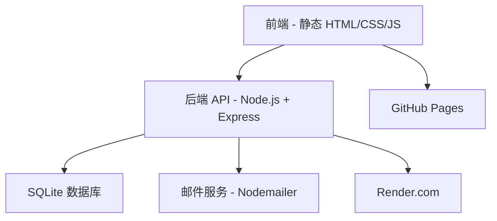

# 🌟 万物评分

<div align="center">


**现代化的社区驱动评分评价平台**

[](https://xunjianyin.github.io/rank-anything/)
[](https://rank-anything-backend.onrender.com/)

[](https://github.com/xunjianyin/rank-anything)
[](https://github.com/xunjianyin/rank-anything)

[English](README.md) | [中文](README_zh.md)

</div>

---

## 📖 目录

- [✨ 功能特色](#-功能特色)
- [🎯 独特之处](#-独特之处)
- [🏗️ 系统架构](#️-系统架构)
- [🚀 快速开始](#-快速开始)
- [🌐 部署指南](#-部署指南)
- [📱 使用指南](#-使用指南)
- [🔧 API 参考](#-api-参考)
- [🛡️ 安全与审核](#️-安全与审核)
- [🤝 贡献指南](#-贡献指南)
- [📄 开源协议](#-开源协议)

---

## ✨ 功能特色

### 🎨 **现代化用户体验**
- 🌈 精美渐变 UI 设计，完全响应式布局
- 🔍 高级搜索功能，支持标签筛选
- ⭐ 交互式五星评分系统
- 📱 移动端优先的响应式界面

### 👥 **社区驱动**
- 🔐 安全的用户认证系统，支持邮箱验证
- 👑 管理员面板，用户管理功能
- 🗳️ 民主化提案系统，社区内容审核
- 👤 用户个人资料，活动追踪

### 🏷️ **智能组织**
- 📂 两级结构：主题 → 对象
- 🏷️ 灵活的标签系统，支持继承
- 🔄 实时内容过滤
- 📊 全面的统计分析功能

### 🛡️ **内容安全**
- 🚫 高级内容过滤（屏蔽不当内容）
- ⚖️ 社区审核系统
- 🚨 用户举报和限制系统
- 📝 编辑历史追踪

### 📈 **数据分析与洞察**
- 📊 详细的用户统计数据
- 📈 每日活动图表
- 🎯 评分分布分析
- 📅 基于时间的活动追踪

---

## 🎯 独特之处

### 🌟 **多编辑者显示**
当多人编辑同一主题或对象时，显示所有贡献者：
- 显示最多 3 个编辑者："由 小明、小红、小刚 编辑"
- 点击 "..." 查看所有编辑者弹窗
- 所有用户名都可点击查看个人资料

### 🔄 **智能标签继承**
- 对象自动继承父主题的标签
- 为单个对象添加特定标签
- 强大的基于标签的搜索和筛选

### 🗳️ **民主化审核**
- 用户可以对不属于自己的内容提出编辑建议
- 社区投票系统决定提案
- 透明的修改前后对比显示

### 📊 **丰富的统计功能**
- 个人用户仪表板，包含活动图表
- 对象特定分析，评分分布
- 主题级别统计和洞察

---

## 🏗️ 系统架构



### 🎨 **前端技术栈**
- **框架**: 原生 JavaScript（无依赖）
- **样式**: 现代 CSS，渐变和动画效果
- **图表**: Chart.js 用于数据可视化
- **部署**: GitHub Pages、Vercel 或 Netlify

### ⚙️ **后端技术栈**
- **运行时**: Node.js 配合 Express.js
- **数据库**: SQLite，完整的数据库架构
- **认证**: JWT 令牌，bcrypt 哈希加密
- **邮件**: Nodemailer，多 SMTP 服务器备用
- **部署**: Render.com 或任何 Node.js 托管服务

---

## 🚀 快速开始

### 📋 前置要求
- 安装 Node.js 16+
- Git 版本控制工具
- 文本编辑器（推荐 VS Code）

### 🔧 本地开发

1. **克隆仓库**
   ```bash
   git clone https://github.com/xunjianyin/rank-anything.git
   cd rank-anything
   ```

2. **启动后端**
   ```bash
   cd backend
   npm install
   node index.js
   ```
   后端将运行在 `http://localhost:3001`

3. **启动前端**
   ```bash
   cd docs
   # 在浏览器中打开 index.html 或使用本地服务器
   python -m http.server 8000  # Python 3
   # 或者
   npx serve .  # Node.js
   ```
   前端将运行在 `http://localhost:8000`

4. **更新配置**
   在 `docs/script.js` 中设置：
   ```javascript
   const BACKEND_URL = 'http://localhost:3001';
   ```

---

## 🌐 部署指南

### 🚀 **后端部署（Render）**

1. **创建 Render 账户** 访问 [render.com](https://render.com)

2. **创建新的 Web 服务**
   - 连接你的 GitHub 仓库
   - 设置 **根目录**: `backend`
   - 设置 **构建命令**: （留空）
   - 设置 **启动命令**: `node index.js`

3. **环境变量**（可选）
   ```
   JWT_SECRET=你的超级秘密JWT密钥
   EMAIL_PASSWORD=你的邮箱应用密码
   ```

4. **部署** 并记录你的后端 URL

### 🌍 **前端部署（GitHub Pages）**

1. **更新后端 URL** 在 `docs/script.js` 中：
   ```javascript
   const BACKEND_URL = 'https://你的应用名.onrender.com';
   ```

2. **启用 GitHub Pages**
   - 进入仓库设置 → Pages
   - 设置源为 `Deploy from a branch`
   - 选择 `main` 分支和 `/docs` 文件夹
   - 保存并等待部署

3. **访问你的应用** `https://你的用户名.github.io/rank-anything/`

---

## 📱 使用指南

### 🔐 **开始使用**
1. **注册** 并进行邮箱验证
2. **登录** 以访问所有功能
3. **探索** 现有主题或创建自己的主题

### 📂 **内容管理**
- **主题**: 创建分类（例如："北京最佳餐厅"）
- **对象**: 向主题添加项目（例如："海底捞火锅"）
- **标签**: 使用灵活的标签系统进行组织
- **评分**: 1-5 星评分，可选文字评价

### 🎯 **每日限制**
- 📝 每天 4 个新主题
- 🎯 每天 32 个新对象
- ⭐ 每天 64 个新评分
- ✏️ 无限制编辑自己的内容

### 🗳️ **社区功能**
- **提出编辑建议** 对不属于你的内容
- **投票** 社区提案
- **查看资料** 其他用户的个人资料
- **用户评价** 点赞/踩用户系统

---

## 🔧 API 参考

### 🔐 **认证**
```http
POST /api/register          # 注册新用户
POST /api/login             # 用户登录
POST /api/verify-email      # 验证邮箱地址
```

### 📂 **主题**
```http
GET    /api/topics          # 列出所有主题
POST   /api/topics          # 创建主题（需要认证）
PUT    /api/topics/:id      # 编辑主题（所有者/管理员）
DELETE /api/topics/:id      # 删除主题（所有者/管理员）
GET    /api/topics/:id/tags # 获取主题标签
```

### 🎯 **对象**
```http
GET    /api/topics/:topicId/objects  # 列出主题中的对象
POST   /api/topics/:topicId/objects  # 创建对象（需要认证）
PUT    /api/objects/:id              # 编辑对象（所有者/管理员）
DELETE /api/objects/:id              # 删除对象（所有者/管理员）
GET    /api/objects/:id/tags         # 获取对象标签
```

### ⭐ **评分与评价**
```http
GET  /api/objects/:objectId/ratings     # 列出评分
POST /api/objects/:objectId/ratings     # 创建/更新评分
GET  /api/objects/:objectId/my-rating   # 获取用户评分
```

### 🗳️ **审核**
```http
GET  /api/moderation/proposals          # 列出提案
POST /api/moderation/proposals          # 创建提案
POST /api/moderation/proposals/:id/vote # 对提案投票
```

### 👥 **用户与管理**
```http
GET  /api/users/:id/profile    # 获取用户资料
GET  /api/users/:id/stats      # 获取用户统计
POST /api/users/:id/rate       # 评价用户（点赞/踩）
GET  /api/admin/users          # 管理员：列出用户
```

---

## 🛡️ 安全与审核

### 🔒 **安全功能**
- **JWT 认证** 安全的令牌处理
- **密码哈希** 使用 bcrypt 加盐哈希
- **邮箱验证** 账户激活机制
- **频率限制** 防止垃圾信息和滥用
- **输入验证** 防止 SQL 注入

### 🚫 **内容过滤**
- **自动检测** 不当内容
- **多语言支持** 内容过滤
- **管理员管理** 过滤词列表
- **实时验证** 内容创建时验证

### ⚖️ **社区审核**
- **提案系统** 民主化内容编辑
- **投票机制** 社区决策
- **用户限制** 基于社区反馈
- **透明流程** 完整的编辑历史

---

## 🤝 贡献指南

我们欢迎贡献！以下是你可以帮助的方式：

### 🐛 **错误报告**
- 使用 GitHub Issues 报告错误
- 包含重现步骤
- 提供浏览器/环境详情

### 💡 **功能请求**
- 通过 GitHub Issues 建议新功能
- 解释用例和好处
- 考虑实现复杂性

### 🔧 **代码贡献**
1. Fork 仓库
2. 创建功能分支
3. 进行更改
4. 如适用，添加测试
5. 提交 Pull Request

### 📝 **文档**
- 改进 README 文件
- 添加代码注释
- 创建教程或指南

---

## 📊 项目统计

<div align="center">


</div>

---

## 📄 开源协议

本项目采用 **MIT 协议** - 详见 [LICENSE](LICENSE) 文件。

---

<div align="center">

**由万物评分团队用 ❤️ 制作**

[](https://github.com/xunjianyin)

⭐ **如果觉得有用请给个星标！** ⭐

</div> 